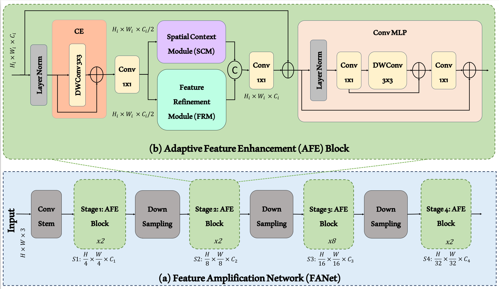
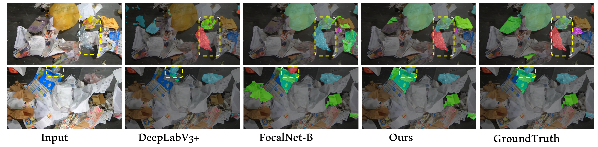

# FANet: Feature Amplification Network for Semantic Segmentation in Cluttered Background
[[arXiv]](https://arxiv.org/pdf/2407.09379)

**Code is released !!!**

## Introduction
Existing deep learning approaches leave out the semantic cues that are crucial in semantic segmentation present in complex scenarios including cluttered backgrounds and translucent objects, etc. To handle these challenges, we propose a feature amplification network (FANet) as a backbone network that incorporates semantic information using a novel feature enhancement module at multi-stages. To achieve this, we propose an adaptive feature enhancement (AFE) block that benefits from both a spatial context module (SCM) and a feature refinement module (FRM) in a parallel fashion. SCM aims to exploit larger kernel leverages for the increased receptive field to handle scale variations in the scene. Whereas our novel FRM is responsible for generating semantic cues that can capture both low-frequency and high-frequency regions for better segmentation tasks. We perform experiments over challenging real-world ZeroWaste-f dataset which contains background-cluttered and translucent objects. Our experimental results demonstrate the state-of-the-art performance compared to existing methods.



Visualization results
-----------------


### Requirements
Please follow the guidelines available at [[Pyramid Vision Transformer repository]](https://github.com/whai362/PVT/tree/v2/segmentation) for **mmsegmentation** installation.

Datasets
-----------------
Get the **Zero Waste dataset** from here [[Zero Waste Dataset]](https://ai.bu.edu/zerowaste/)

# Citation
```
@inproceedings{Ali2024FANet,
  title={FANet: Feature Amplification Network for Semantic Segmentation in Cluttered Background},
  author={Ali, Muhammad and Javaid, Mamoona and Noman, Mubashir and Fiaz, Mustansar and Khan, Salman},
  booktitle={IEEE ICIP 2024},
  year={2024}
}
```
